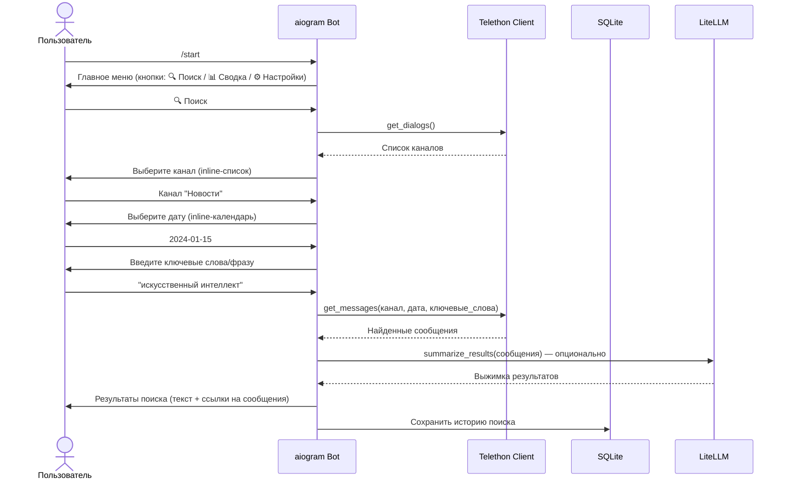
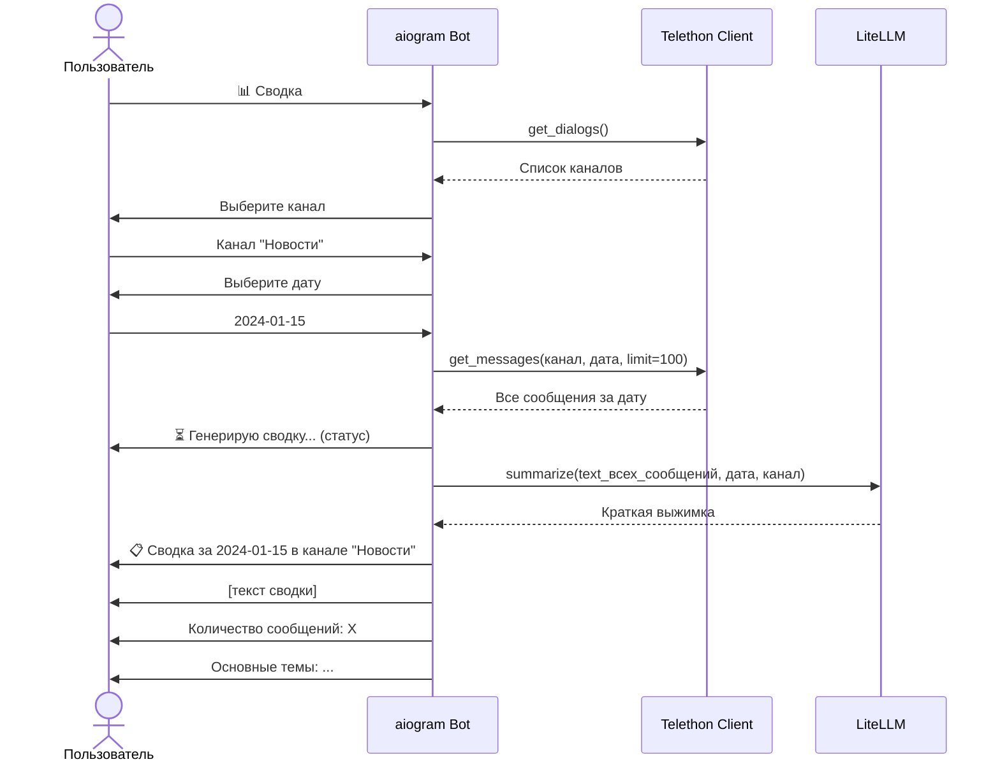

# План разработки Telegram бота для поиска и суммаризации сообщений в каналах

## 1. Сводка требований

| Требование | Детали |
|---|---|
| **Тип клиента** | Telethon (личный аккаунт) — чтение любых каналов, где состоит пользователь |
| **UI бота** | Inline-кнопки: выбор канала → дата → действие (поиск/сводка) |
| **AI/LLM** | Переключаемые провайдеры (OpenAI, Gemini, Ollama, Anthropic) через LiteLLM |
| **Запуск** | Локально Windows → перенос на VPS Linux |
| **Хранение** | SQLite (кэш каналов, история поиска, настройки) |

---

## 2. Технологический стек

| Компонент | Технология | Обоснование |
|---|---|---|
| **Язык** | Python 3.10+ | Лучшая экосистема для Telegram |
| **Bot Framework** | [aiogram](https://docs.aiogram.dev/) 3.x | Асинхронный, современный, отличная поддержка inline-клавиатур |
| **Telegram Client** | [Telethon](https://docs.telethon.dev/) 1.x | Зрелый, асинхронный, читает сообщения от имени пользователя |
| **AI/LLM** | [LiteLLM](https://docs.litellm.ai/) | Единый интерфейс для ~100+ LLM-провайдеров |
| **База данных** | SQLite (через aiosqlite) | Не требует сервера, легко мигрирует |
| **Конфигурация** | python-dotenv + .env | Безопасное хранение токенов |

---

## 3. Архитектура системы

### 3.1 Диаграмма компонентов

```
┌─────────────────────────────────────────────────────────┐
│                    Telegram Bot (aiogram)                │
│  ┌──────────┐  ┌──────────────┐  ┌──────────────────┐   │
│  │ handlers │→│  keyboards    │  │   middleware     │   │
│  │ (лог.)   │  │  (UI gen)    │  │   (аутентиф.)    │   │
│  └────┬─────┘  └──────────────┘  └──────────────────┘   │
│       │                                                  │
│       ▼                                                  │
│  ┌─────────────────────────────────────┐                 │
│  │          Dispatcher / Логика         │                 │
│  └────┬──────────────┬─────────────────┘                 │
│       │              │                                   │
└───────┼──────────────┼───────────────────────────────────┘
        │              │
        ▼              ▼
┌──────────────┐ ┌──────────────────┐
│  Telethon    │ │   LiteLLM        │
│  Client      │ │   Service        │
│  (User)      │ │   (AI Provider)  │
│              │ │                  │
│  read_msgs() │ │  summarize()     │
│  get_dialogs │ │  search_intent() │
└──────┬───────┘ └────────┬─────────┘
       │                  │
       ▼                  ▼
┌────────────────────────────────────────┐
│         SQLite Storage (aiosqlite)      │
│  - cached_channels                     │
│  - search_history                      │
│  - user_settings (ai_provider, api_key)│
└────────────────────────────────────────┘
```

### 3.2 Поток команд (sequence)

**Поток поиска сообщений:**



**Поток суммаризации за дату:**



---

## 4. Структура проекта

```
tg_bot_finder/
│
├── bot/                          # Основной пакет бота
│   ├── __init__.py
│   ├── main.py                   # Точка входа, запуск поллинга
│   ├── config.py                 # Загрузка конфигурации из .env
│   │
│   ├── handlers/                 # Обработчики команд
│   │   ├── __init__.py
│   │   ├── start.py              # /start, главное меню
│   │   ├── search.py             # Логика поиска
│   │   ├── summary.py            # Логика суммаризации
│   │   └── settings.py           # Настройки AI-провайдера
│   │
│   ├── keyboards/                # Генерация inline-клавиатур
│   │   ├── __init__.py
│   │   ├── main.py               # Главное меню
│   │   ├── channels.py           # Список каналов с пагинацией
│   │   ├── calendar.py           # Inline-календарь для выбора даты
│   │   └── settings.py           # Меню настроек
│   │
│   ├── services/                 # Бизнес-логика / внешние сервисы
│   │   ├── __init__.py
│   │   ├── telegram_client.py    # Обёртка над Telethon
│   │   ├── llm_service.py        # Обёртка над LiteLLM
│   │   └── formatter.py          # Форматирование результатов
│   │
│   ├── storage/                  # Работа с БД
│   │   ├── __init__.py
│   │   ├── database.py           # Инициализация SQLite, миграции
│   │   └── models.py             # Data-классы / схемы
│   │
│   └── utils/
│       ├── __init__.py
│       └── helpers.py            # Вспомогательные функции
│
├── data/                         # Runtime-данные
│   └── .gitkeep                  # Папка для session файлов Telethon + БД
│
├── .env                          # Переменные окружения (НЕ в git)
├── .env.example                  # Шаблон .env
├── requirements.txt              # Зависимости
├── README.md                     # Документация
└── plans/
    └── development_plan.md       # Этот файл
```

---

## 5. Поэтапный план разработки

### Этап 1: Инициализация проекта и базовый скелет

**Задачи:**
1. Создать структуру директорий
2. Установить зависимости (`aiogram`, `telethon`, `litellm`, `python-dotenv`, `aiosqlite`)
3. Создать [`.env.example`](.env.example) с шаблоном настроек
4. Реализовать [`bot/config.py`](bot/config.py) — загрузка и валидация конфигурации
5. Реализовать [`bot/main.py`](bot/main.py) — точка входа с запуском aiogram и Telethon

**Критерий готовности:** Бот запускается, отвечает на `/start`.

---

### Этап 2: Подключение Telethon и получение списка каналов

**Задачи:**
1. Реализовать [`bot/services/telegram_client.py`](bot/services/telegram_client.py):
   - Асинхронная авторизация через session file
   - Метод `get_dialogs()` — получение списка доступных каналов/чатов
   - Метод `search_messages(channel, date, query)` — поиск по ключевым словам
   - Метод `get_messages(channel, date)` — получение всех сообщений за дату
2. Сохранить сессию Telethon в `data/session.session`

**Критерий готовности:** Бот в ответ на команду выводит список каналов пользователя.

---

### Этап 3: Inline-клавиатуры и навигация

**Задачи:**
1. Реализовать [`bot/keyboards/main.py`](bot/keyboards/main.py) — главное меню (🔍 Поиск, 📊 Сводка, ⚙️ Настройки)
2. Реализовать [`bot/keyboards/channels.py`](bot/keyboards/channels.py) — динамический список каналов с пагинацией (если > 10)
3. Реализовать [`bot/keyboards/calendar.py`](bot/keyboards/calendar.py) — inline-календарь для выбора даты
4. Реализовать [`bot/keyboards/settings.py`](bot/keyboards/settings.py) — меню выбора AI-провайдера

**Критерий готовности:** Можно пройти весь UX-путь: меню → выбор канала → выбор даты → выбор действия.

---

### Этап 4: Обработчики поиска и суммаризации

**Задачи:**
1. Реализовать [`bot/handlers/search.py`](bot/handlers/search.py):
   - Cбор контекста: канал, дата, ключевые слова
   - Вызов Telethon для поиска сообщений
   - Форматирование и отправка результатов (текст + ссылки)
2. Реализовать [`bot/handlers/summary.py`](bot/handlers/summary.py):
   - Cбор контекста: канал, дата
   - Вызов Telethon для получения сообщений
   - Опционально: вызов LLM для сводки

**Критерий готовности:** Можно найти сообщения по ключевым словам за дату в выбранном канале.

---

### Этап 5: AI-суммаризация через LiteLLM

**Задачи:**
1. Реализовать [`bot/services/llm_service.py`](bot/services/llm_service.py):
   - Метод `summarize(text, channel, date)` — создаёт краткую выжимку
   - Поддержка нескольких провайдеров (OpenAI, Gemini, Ollama, Anthropic)
   - Умное переключение провайдера на основе user_settings
   - Обработка длинных сообщений (разбиение на чанки + консолидация)
2. Реализовать хендлер [`bot/handlers/settings.py`](bot/handlers/settings.py):
   - Выбор провайдера
   - Ввод/смена API-ключа

**Критерий готовности:** Сводка за дату генерируется через выбранный AI-провайдер.

---

### Этап 6: Хранилище SQLite

**Задачи:**
1. Реализовать [`bot/storage/database.py`](bot/storage/database.py):
   - Таблица `cached_channels` (channel_id, title, username, last_updated)
   - Таблица `search_history` (id, channel, date, query, result_summary, timestamp)
   - Таблица `user_settings` (key, value) — хранение выбранного AI-провайдера, ключей
2. Реализовать [`bot/storage/models.py`](bot/storage/models.py) — Pydantic/dataclass модели

**Критерий готовности:** Настройки сохраняются между перезапусками; история поиска доступна.

---

### Этап 7: Улучшение UX и обработка ошибок ✅

**Задачи:**
1. Добавить индикаторы загрузки: "⏳ Ищу сообщения...", "⏳ Генерирую сводку..."
2. Graceful handling: сообщение "Канал недоступен", "Нет сообщений за эту дату", "Требуется больше контекста"
3. Middleware на аутентификацию (если нужно ограничить доступ к боту)
4. FSM (Finite State Machine) от aiogram для управления состоянием диалога

**Критерий готовности:** Бот корректно обрабатывает все граничные случаи, понятные сообщения об ошибках.

**Реализация (29.06.2026):**

**1. Индикаторы загрузки** — добавлены во все длительные операции:
- [`bot/handlers/search.py`](bot/handlers/search.py):
  - `⏳ Загружаю список каналов...` — при загрузке списка каналов через Telethon
  - `⏳ Ищу сообщения по запросу «{query}» за {date}...` — перед поиском сообщений
  - `📤 Отправляю результаты ({count} из {total})...` — при отправке большого числа результатов
- [`bot/handlers/summary.py`](bot/handlers/summary.py):
  - `⏳ Загружаю список каналов...` — при загрузке списка каналов
  - `⏳ Получаю сообщения за {date}...` — перед получением сообщений от Telethon
  - `🤖 Генерирую сводку... Это может занять несколько секунд.` — перед вызовом LLM
  - `📊 Собираю статистику...` — перед сбором статистики по сообщениям

**2. Graceful handling ошибок** — обработка всех граничных случаев:
- [`bot/handlers/search.py`](bot/handlers/search.py):
  - `ConnectionError`/`TimeoutError` — потеря соединения с Telegram
  - `ChatAdminRequired`/`ChannelPrivate` — канал недоступен (нет прав)
  - `FloodWait` — превышен лимит запросов Telegram
  - Пустой список каналов — предложение обновить список
  - Пустые результаты поиска — информативное сообщение
  - Устаревшая FSM-сессия (отсутствует `channel_id`/`search_date_str`) — "Сессия устарела, начните заново"
  - Общие исключения — вывод типа ошибки и рекомендация попробовать позже
- [`bot/handlers/summary.py`](bot/handlers/summary.py):
  - Все аналогичные ошибки Telethon (см. выше)
  - Ошибки LLM: `AuthenticationError` (неверный API-ключ), `RateLimitError` (превышен лимит запросов к LLM), `APIConnectionError` (провайдер недоступен), общие ошибки LLM
  - Сохранение истории в БД обёрнуто в `try/except` чтобы не ломать UX при ошибке записи

**3. Middleware аутентификации:**
- Создан [`bot/middleware/auth.py`](bot/middleware/auth.py) — `AuthMiddleware`:
  - Проверяет `user_id` из переменной окружения `ALLOWED_USER_IDS`
  - Если `ALLOWED_USER_IDS` не задан — доступ открыт всем
  - Если задан — пропускает только указанных пользователей, остальным отправляет "⛔ У вас нет доступа"
  - Логирует попытки несанкционированного доступа
- Создан [`bot/middleware/__init__.py`](bot/middleware/__init__.py) — инициализация пакета middleware
- Зарегистрирован в [`bot/main.py`](bot/main.py):
  - `dp.message.middleware(AuthMiddleware())` — для текстовых сообщений
  - `dp.callback_query.middleware(AuthMiddleware())` — для inline-кнопок
- Обновлён [`bot/config.py`](bot/config.py):
  - Добавлено поле `allowed_user_ids: list` в dataclass `Config`
  - Добавлена функция `_parse_user_ids()` для парсинга строки `"123,456,789"` в список `int`
- Обновлён [`.env.example`](.env.example):
  - Добавлена переменная `ALLOWED_USER_IDS` с комментарием

**4. FSM (Finite State Machine):**
- Уже реализована в предыдущих этапах:
  - `SearchStates` (select_channel → select_date → enter_query) в `bot/handlers/search.py`
  - `SummaryStates` (select_channel → select_date) в `bot/handlers/summary.py`
  - `SettingsStates` (provider → api_key) в `bot/handlers/settings.py`
- На Этапе 7 добавлена **валидация целостности FSM-данных**: проверка наличия `channel_id` и `search_date_str` в состоянии с информативным сообщением при устаревшей сессии

**Изменённые/созданные файлы:**
| Файл | Действие |
|---|---|
| `bot/handlers/search.py` | Добавлены индикаторы загрузки и полная обработка ошибок |
| `bot/handlers/summary.py` | Добавлены индикаторы загрузки и полная обработка ошибок (Telethon + LLM) |
| `bot/middleware/auth.py` | **Создан** — middleware аутентификации по user_id |
| `bot/middleware/__init__.py` | **Создан** — инициализация пакета |
| `bot/main.py` | Зарегистрирован AuthMiddleware |
| `bot/config.py` | Добавлено поле `allowed_user_ids` и функция `_parse_user_ids()` |
| `.env.example` | Добавлена переменная `ALLOWED_USER_IDS` |

---

### Этап 8: Подготовка к деплою на сервер ✅

**Задачи:**
1. Создать `requirements.txt` с фиксированными версиями
2. Написать `README.md` с инструкцией по установке и настройке
3. Написать Dockerfile (опционально)
4. Инструкция по переносу session-файла Telethon

**Критерий готовности:** Проект можно клонировать на VPS, запустить одной командой.

**Реализация (29.06.2026):**

**1. `requirements.txt`** — все зависимости с фиксированными версиями:
- `aiogram==3.18.0`, `telethon==1.39.0`, `litellm==1.61.0`, `python-dotenv==1.1.0`, `aiosqlite==0.20.0`, `pydantic==2.10.0`, `cryptography==44.0.0`

**2. `README.md`** — полная документация:
- Описание возможностей и всех AI-провайдеров (бесплатные и платные)
- Пошаговая инструкция по локальной установке
- Получение `BOT_TOKEN`, `API_ID`, `API_HASH`
- Деплой на VPS через systemd с разделением секретов
- **Развёрнутая инструкция по переносу session-файла Telethon** (два способа: scp и tmux)
- Объяснение почему нельзя авторизоваться в systemd (EOFError при отсутствии stdin)
- Docker-деплой с инструкцией по интерактивной авторизации
- Секция безопасности и управления сервисом

**3. `Dockerfile`** — создан:
- Базовый образ: `python:3.11-slim`
- Создание системного пользователя `tg_bot`
- Установка зависимостей, копирование кода
- Работа от непривилегированного пользователя

**4. `deploy/setup_server.sh`** — обновлён:
- Создание системного пользователя `tg_bot`
- Создание `/etc/tg_bot_finder/secrets.env` для критичных данных (API_ID, API_HASH, PHONE_NUMBER)
- Два `EnvironmentFile` в systemd (secrets.env + .env)
- Права доступа: `root:tg_bot 640` на секреты, `tg_bot:tg_bot 640` на .env
- Параметры безопасности: `PrivateTmp=true`, `NoNewPrivileges=true`

**Созданные/изменённые файлы:**
| Файл | Действие |
|---|---|
| `requirements.txt` | Исправлено: все версии зафиксированы |
| `deploy/setup_server.sh` | Обновлён: User=tg_bot, два EnvironmentFile, безопасность |
| `Dockerfile` | **Создан** — контейнеризация проекта |
| `README.md` | Обновлён: Docker, перенос session, безопасность |

---

## 6. Обработка ошибок и граничные случаи

| Ситуация | Обработка |
|---|---|
| Нет сообщений за дату | "За 2024-01-15 в канале X сообщений не найдено" |
| Канал недоступен/удалён | "Канал недоступен. Обновите список каналов" |
| Telethon сессия истекла | "Требуется переавторизация, запустите /relogin" |
| LLM провайдер недоступен | "Провайдер Y недоступен, переключитесь на другой /settings" |
| Сообщений слишком много (>100) | Автоматическая пагинация + предупреждение пользователя |
| Ключевые слова не указаны | "Пожалуйста, введите ключевые слова для поиска" |

---

## 7. Переменные окружения (`.env`)

```env
# Токен бота (от BotFather)
BOT_TOKEN=your_bot_token_here

# Telegram аккаунт (Telethon)
API_ID=your_api_id_here
API_HASH=your_api_hash_here
PHONE_NUMBER=+79001234567

# AI провайдер по умолчанию: openai / gemini / ollama / anthropic
DEFAULT_AI_PROVIDER=openai

# OpenAI
OPENAI_API_KEY=sk-...

# Google Gemini
GEMINI_API_KEY=...

# Anthropic Claude
ANTHROPIC_API_KEY=...

# Ollama (локальный)
OLLAMA_API_BASE=http://localhost:11434
OLLAMA_MODEL=llama3

# Настройки БД
DATABASE_PATH=data/bot_database.sqlite
```

---

## 8. Риски и их митигация

| Риск | Митигация |
|---|---|
| **Telethon требует phone code** при каждом перезапуске | Session-файл решает проблему; одноразовая авторизация при первом запуске |
| **AI провайдер может рейт-лимитить** | Очередь запросов, fallback на другой провайдер |
| **Сообщений много (>1000)** | Разбивка по чанкам; ограничение поиска последними N днями |
| **Утечка API ключей** | `.env` в `.gitignore`; инструкция |

---

## 9. Принцип работы с AI-провайдерами

LiteLLM унифицирует все запросы через единый синтаксис:

```python
import litellm
response = await litellm.acompletion(
    model="gpt-4o-mini",        # или "gemini/gemini-pro", "ollama/llama3"
    messages=[{"role": "user", "content": prompt}]
)
```

Пользователь в `/settings` выбирает провайдер, и бот подставляет соответствующую модель в запрос. API-ключи хранятся в `.env` для безопасности.

---

## 10. FSM (Finite State Machine) — управление диалогами

aiogram 3 использует FSM для трекинга состояния диалога:

```
States:
  MAIN_MENU
  SEARCH_SELECT_CHANNEL   →  SEARCH_SELECT_DATE  →  SEARCH_ENTER_QUERY  →  SEARCH_RESULTS
  SUMMARY_SELECT_CHANNEL  →  SUMMARY_SELECT_DATE →  SUMMARY_RESULT
  SETTINGS_PROVIDER
  SETTINGS_API_KEY
```

Каждый хендлер знает, на каком этапе диалога пользователь, и обрабатывает ввод соответственно.
